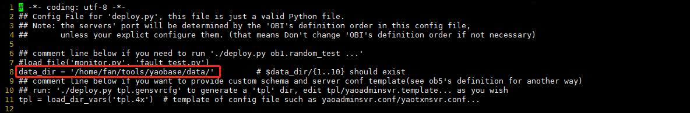
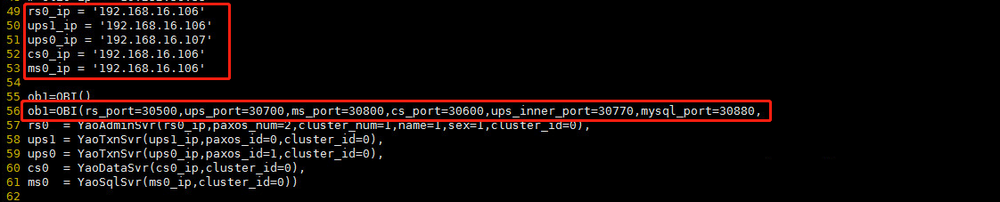

# mysqltest测试

## 1.关闭防火墙

```
systemctl status firewalld.service
systemctl stop firewalld.service
systemctl disable firewalld.service
```

## 2.配置免密登录

```
添加集群ip映射
vim  /etc/hosts
192.168.16.106 slavel2
192.168.16.107 slavel3

ssh localhost # 生成~/.ssh/目录
ssh-keygen -t rsa # 生成密码文件,一直回车

# ip和域名可以都配置
ssh-copy-id fan@192.168.16.106
ssh-copy-id fan@192.168.16.107

验证
ssh fan@192.168.16.106
```

## 3 安装RPM包

### 3.1 指定目录安装

```
sudo rpm -ivh --prefix=/home/fan/tools/yaobase --nodeps --force yaobase-1.0.1.0.rpm
```

### 3.2 修改目录权限

```
sudo chown -R fan:fan /home/fan/tools/yaobase
```

## 4测试环境

| 服务器ip       | 服务         | paxos      |
| -------------- | ------------ | ---------- |
| 192.168.16.106 | AS/TS0/DS/SS | TS: paxos0 |
| 192.168.16.107 | TS1          | TS: paxos0 |

### 4.1mysqltest结构目录

| **deploy主要文件结构** | **描述**                             |
| ---------------------- | ------------------------------------ |
| \|-- mysql_test        | 测试所需要的test文件和测试生成的结果 |
| \|-- deploy.py         | deploy自动部署脚本                   |
| \|-- config.py         | deploy工具的配置文件                 |
| \|-- mysqltest         | 可执行文件,mysql自带的测试引擎       |

| **mysql_test主要文件结构** | **描述**                                 |
| -------------------------- | ---------------------------------------- |
| \|-- t                     | 存放测试用的test文件                     |
| \|-- record                | 存放record模式下生成的record文件         |
| \|-- r                     | result文件，用于test模式下测试和结果对比 |
| \|-- config.py             | 指定数据库端口和文件存放路径             |

## 5.修改配置文件

### 5.1修改config.py文件

a）指定为YAOBASE安装目录下的data目录



b）修改ip（当前测试为单集群双paxos组）


c）修改各个角色的配置修改各个server对应的IP，并保证各个server的端口是没有被占用的。



### 5.2修改multi_deploy.py文件

a) 在update_bin下修改目录，替换为自己的YAOBASE安装指定目录下的bin文件


b) Obcfg中的dir路径，替换为自己的安装路径


c）deploy部署集群时获取网卡名称的命令，redhat和centos操作系统这个命令返回的内容不一样,所以需要根据操作系统类型进行更改，centos操作系统对应位置为{print $8},redhat操作系统为{print $7}


## 6修改可执行文件的权限

```
#在mysqltest_yaobase目录下操作如下命令
mkdir tools
cp -r /home/fan/tools/yaobase/bin/ /home/fan/tools/mysqltest_yaobase/
cp -r /home/fan/tools/yaobase/bin/as_admin /home/fan/tools/mysqltest_yaobase/tools/
cp -r /home/fan/tools/yaobase/bin/ts_admin /home/fan/tools/mysqltest_yaobase/tools/
cp -r /home/fan/tools/yaobase/lib/ /home/fan/tools/mysqltest_yaobase/
chmod 777 mysqltest
chmod 777 multi_deploy.py
chmod 777 tools/as_admin
chmod 777 tools/ts_admin
```

## 7检查免密登陆

```
./multi_deploy.py ob1.check_ssh
#出现“OK”字样表示成功
```


## 8自动部署

```
./multi_deploy.py ob1.reboot
#出现如下情况，表示部署成功。
```


## 9使用说明

### 9.1命令格式：

```
./multi_deploy.py ob1.mysqltest [_quiet_=True] [‘testset=test1[,test1[,...]]’] [‘testpat=rowkey_*’][record|test] [disable-reboot]
```

### 9.2参数说明：

| 参数                          | 说明                                                         |
| ----------------------------- | ------------------------------------------------------------ |
| _quiet_=True                  | 允许观察case运行结果，默认为true                             |
| ‘testset=test1[,test1[,...]]’ | 若不指定该参数，默认会执行t文件目录中存放的所有文件，若只希望执行某一个或某一些case，则在testset后面指定需要测试的文件名就可以了。 |
| ‘testpat=rowkey_*’            | 待定                                                         |
| record\|test                  | 指定test测试模式和record测试模式                             |
| disable-reboot                | 执行测试案例时不重启集群                                     |

### 9.3功能说明

#### 9.3.1record模式

***第一次使用deploy工具测试生成基准测试结果文件

将.test测试文件放在/mysql_test/t文件夹下，用record模式下测试，生成的文件存放在/mysql_test/record/文件夹下。

```bash
#指定一个test文件进行测试
./multi_deploy.py ob1.mysqltest testset=0001_alias_no_or_have_partition record
#指定多个test文件进行测试(多个文件用逗号隔开)
./multi_deploy.py ob1.mysqltest testset=0001_alias_no_or_have_partition,0005_add_all_type_column record
#自动测试mysql_test/t下的所有test文件
./multi_deploy.py ob1.mysqltest record
```

**测试结束后，将record中生成的后缀为.record文件拷贝至/mysql_test/r/文件夹下，并修改后缀名.result，需要手动观察测试结果，或与前面所做的FT测试结果进行对比，若与预想结果一致，认为正确执行，该result文件即为基准结果。**

#### 9.3.2test模式（常用）

等价于回归测试-----将基准test case拷贝至t/下，然后在待测case已有基准测试结果result文件的前提下，在test模式下针对被测case进行测试，

```bash
#指定一个test文件进行测试
./multi_deploy.py ob1.mysqltest testset=0001_alias_no_or_have_partition test
#指定多个test文件进行测试(多个文件用逗号隔开)
./multi_deploy.py ob1.mysqltest testset=0001_alias_no_or_have_partition,0005_add_all_type_column test
#自动测试mysql_test/t下的所有test文件
nohup ./multi_deploy.py ob1.mysqltest test > test_log/101_svn1030_202209081437.log 2>&1 &
nohup ./multi_deploy.py ob1.mysqltest test > test_log/106_svn1030_202209081437.log 2>&1 &
```

测试完毕之后与r/下基准result文件进行对比，显示结果差异。


